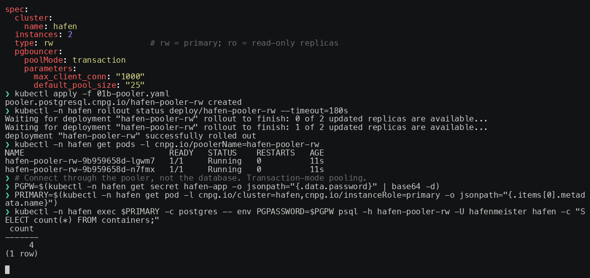
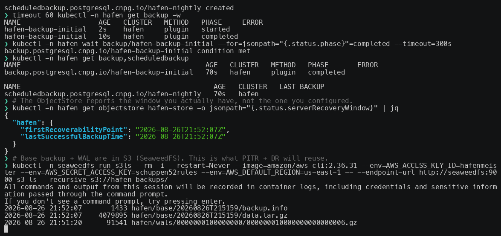
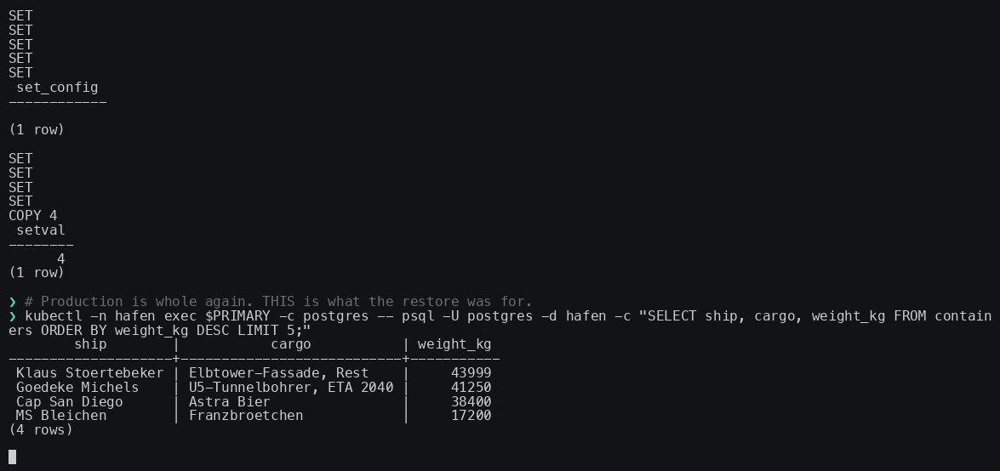
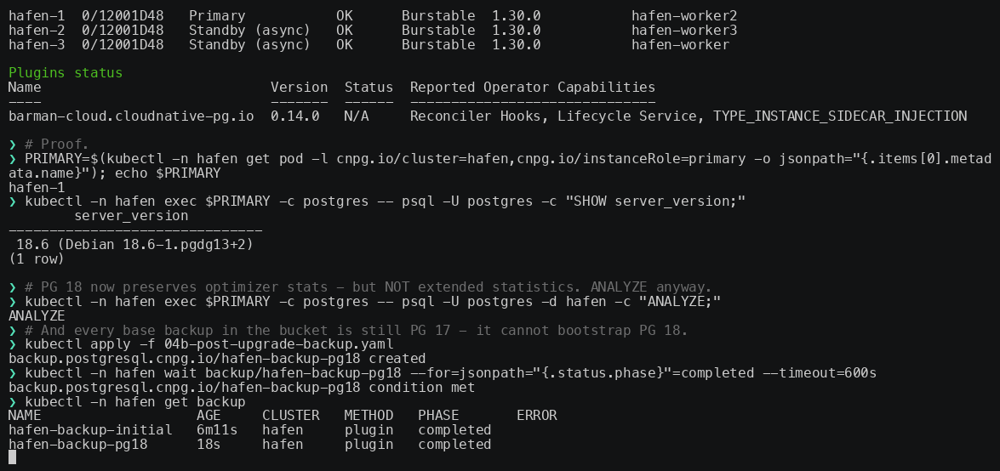
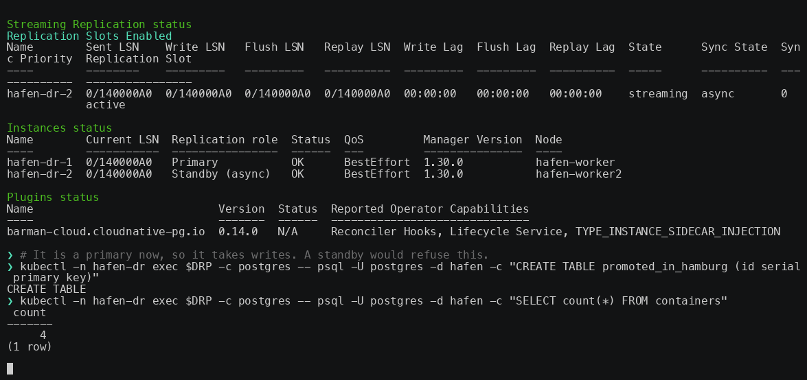

# Running PostgreSQL on Kubernetes — Day 2 Operations with CloudNativePG

Slides and demo material for the talk at **ContainerDays Hamburg 2026**
by Michael Raeck.

Everything runs in a local **kind** cluster — no cloud account, no credit card.
The demos were recorded with asciinema and played back during the talk with
live commentary; the recordings are included so you can replay them yourself.

**▶ [Play the recordings in your browser](https://mixxor.github.io/containerdays-2026-cnpg/)**

## Contents

| Path | What |
|---|---|
| [slides/cnpg-day2-operations-containerdays-2026.pdf](slides/cnpg-day2-operations-containerdays-2026.pdf) | The deck (35 slides) |
| [slides/slides.md](slides/slides.md) | Slide source incl. speaker notes |
| [demos/](demos/) | Manifests, setup script, driver scripts, recordings |
| [demos/asciinema-notes.md](demos/asciinema-notes.md) | Per-demo commands + narration cues |
| [demos/monitoring/](demos/monitoring/) | PodMonitor manifests, Grafana dashboard 20417 |
| [docs/](docs/) | The GitHub Pages site that plays the recordings |

## The recordings

A terminal recording is not a video file &mdash; it is a stream of timed writes,
so it stays sharp at any size and you can select the text out of it. That also
means it gets a real player: **pause, scrub, jump to a beat**. The thumbnails
below are each recording's last frame; click one to watch it.

| | |
|---|---|
| [](https://mixxor.github.io/containerdays-2026-cnpg/demo1.html) | **1 &mdash; Deploy**<br>One Cluster CR: 3 instances, streaming replication, a PgBouncer Pooler in front.<br><br>[&#9654; play it](https://mixxor.github.io/containerdays-2026-cnpg/demo1.html) &middot; [demo1.cast](demos/demo1.cast) |
| [](https://mixxor.github.io/containerdays-2026-cnpg/demo2.html) | **2 &mdash; ObjectStore + Backup**<br>Wire the barman-cloud plugin sidecar, archive WAL and base backups to S3.<br><br>[&#9654; play it](https://mixxor.github.io/containerdays-2026-cnpg/demo2.html) &middot; [demo2.cast](demos/demo2.cast) |
| [](https://mixxor.github.io/containerdays-2026-cnpg/demo3.html) | **3 &mdash; Point-in-Time Recovery**<br>An UPDATE without a WHERE, then a restore to a timestamp before it.<br><br>[&#9654; play it](https://mixxor.github.io/containerdays-2026-cnpg/demo3.html) &middot; [demo3.cast](demos/demo3.cast) |
| [](https://mixxor.github.io/containerdays-2026-cnpg/demo4.html) | **4 &mdash; Major upgrade, 17 &rarr; 18**<br>One field. `imageName` 17 &rarr; 18, `pg_upgrade --link`, replicas re-cloned.<br><br>[&#9654; play it](https://mixxor.github.io/containerdays-2026-cnpg/demo4.html) &middot; [demo4.cast](demos/demo4.cast) |
| [](https://mixxor.github.io/containerdays-2026-cnpg/demo5.html) | **5 &mdash; Replica cluster for DR**<br>A second Cluster in continuous restore from the same bucket, then promoted.<br><br>[&#9654; play it](https://mixxor.github.io/containerdays-2026-cnpg/demo5.html) &middot; [demo5.cast](demos/demo5.cast) |

Each page carries the narration beats as a chapter list, and the player pauses
at every one &mdash; the same pause points the deck uses live.

Locally, with no browser:

```bash
asciinema play -i 2 demos/demo1.cast     # idle compressed to 2s
```

There is deliberately no GIF or MP4 export. A GIF cannot be paused or seeked,
which is the one thing you want from a two-minute recording of a restore.

## Run the demos yourself

```bash
cd demos
./00-setup-kind.sh    # kind cluster + CNPG operator + barman-cloud plugin
                      # + SeaweedFS (S3) + kube-prometheus-stack
```

Then walk 01 → 05 in order. Each step builds on the previous cluster state:

| Step | Demo |
|---|---|
| `01-cluster.yaml`, `01b-pooler.yaml` | Deploy a 3-instance cluster + PgBouncer Pooler |
| `02-objectstore.yaml`, `02-scheduled-backup.yaml`, `02-cluster-patch.yaml` | WAL archiving + scheduled backups to S3 |
| `03-pitr-restore.yaml` | Break the data, restore point-in-time into a new cluster, repair production |
| `04-major-upgrade.yaml`, `04b-post-upgrade-backup.yaml` | PostgreSQL 17 → 18 major upgrade, then a fresh base backup |
| `05-replica-cluster.yaml`, `05b-promote.yaml` | Replica cluster from the object store, then promote it |

## Re-record a demo

The driver scripts in [demos/rec/](demos/rec/) type the commands and wait on
real cluster state, so a recording is reproducible rather than performed:

```bash
cd demos
asciinema rec --overwrite --window-size 120x32 -i 2 \
  -c "bash rec/demo1-driver.sh" demo1.cast
./rec/publish.sh          # trim trailing idle + regenerate markers.json
```

`markers.json` is derived from the `say` lines in the drivers — it is what
pauses the player at each narration beat, both in the deck and on the Pages
site, so regenerate it after any re-record.

**Verify a re-record by asserting on cast content, never on the exit code.**
Headless `kubectl` without a TTY writes nothing to stdout and produces a
green-but-empty recording; the drivers guard against that, and you should
still grep the finished cast for the values you expect to see.

## Versions pinned

| | |
|---|---|
| CloudNativePG operator | **1.30.0** |
| Barman Cloud plugin | **0.14.0** — sidecar via CNPG-I, *not* the in-tree backup code path, which is deprecated and is removed in operator 1.31 |
| PostgreSQL | **17.11** → **18.6** (`-minimal-trixie`) for the major upgrade demo |
| cert-manager | **v1.21.1** — required by the Barman plugin |
| SeaweedFS | **4.44** — in-cluster S3, Apache-2.0 |
| AWS CLI | **2.36.31** — used to inspect the bucket |
| kind | **0.32.0** (node image v1.36.1) |

## About the credentials in here

The S3 access key `hafenmeister` / `schuppen52rules` and the Grafana password
are **throwaway values for a local kind cluster**. They are in the manifests on
purpose so the demos are copy-pasteable. Do not carry them anywhere real.

## Notes on the slide source

`slides/slides.md` is [Slidev](https://sli.dev) markdown. The Slidev project
itself is not part of this repo — the rendered PDF is. The `<Cast name="…" />`
tags mark where a recording was played; the matching file is
`demos/demo<N>.cast`. Speaker notes are the HTML comments at the end of each
slide.

In the PDF, each of those five slides shows the recording's **last frame** —
which for every one of these demos is the point the demo was making — and links
to the page where it actually plays. A PDF cannot run a terminal, and the video
formats that a PDF *can* embed only play in Adobe Acrobat.

## License

[Apache License 2.0](LICENSE) — Copyright 2026 Michael Raeck.

Covers the manifests, scripts and slide material in this repository.
Third-party names and marks (CloudNativePG, PostgreSQL, Kubernetes, Grafana,
ContainerDays) belong to their respective owners; the license grants no rights
to them.
