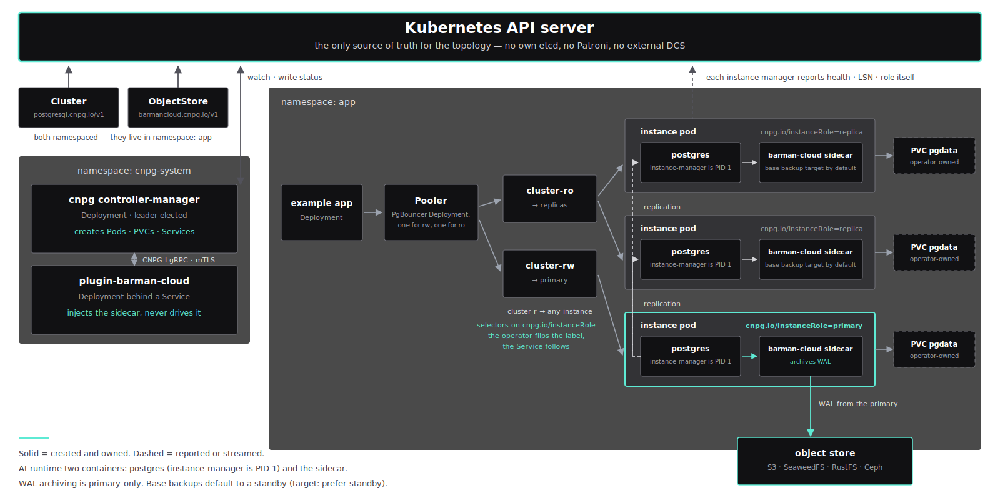
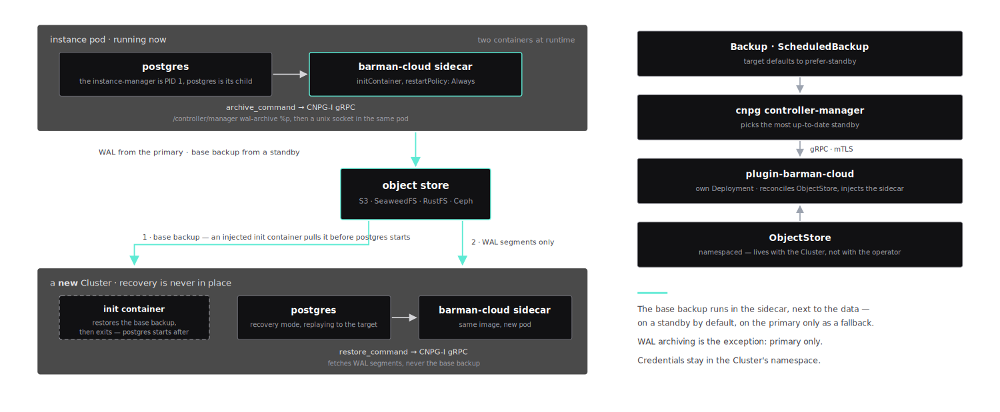

# Running PostgreSQL on Kubernetes<br>in Production

## Day 2 Operations with CloudNativePG

<div class="who">Michael Raeck</div>
<div class="when">ContainerDays Hamburg &nbsp;·&nbsp; September 2026</div>

---
layout: default
---

# $whoami

<div class="who-block">

<br />

## **Michael Raeck**

<br />

**"Hands on" CTO, Paladyn** · venture builder (Woonzorgweb, ~150k users/month)

**Independent Platform Engineer**, Vantralis
<br />
<br />
Kubernetes, GitOps & CloudNativePG in ISO 27001-certified environments
<br />
<br />

<div class="sub" style="margin-top:.9rem">

**100+ CNPG databases** · bucket + user + backup schedule generated per DB CR

</div>

</div>

---
layout: default
---

# CloudNativePG, August 2026

<div class="sub">What is current, and what is already end of life.</div>

<div class="nohead">

| | |
|---|---|
| **1.30.0** | current stable, 29 June 2026 |
| **1.29.x** | supported until **29 Sep 2026**, four weeks from now |
| **1.28 / 1.27 / 1.26** | **end of life** |
| **PostgreSQL 14–18** | 18.4 at 1.30.0's release · **18.6** current (18.5 never shipped) |
| **Kubernetes 1.34–1.36** | |

</div>

> **⚠ Three CVEs.** `CVE-2026-44477`, CVSS 9.4, **metrics exporter** (fixed 1.29.1 / 1.28.3).
> `CVE-2026-55769` privilege escalation via the public schema, and `CVE-2026-55765` cleartext
> passwords on `CREATE/ALTER ROLE`, both fixed in **1.30.0**, backported to 1.29.2 / 1.28.4.

---
layout: default
---

# The Operator Is the Easy Part

<div class="sub">One CR gets you a cluster. Everything that hurts afterwards lives underneath it.</div>

<div class="metric"><b>Storage</b> — the IOPS you did not choose, and the WAL volume you did not separate</div>
<div class="metric"><b>Object store</b> — it decides how long recovery takes, not Postgres</div>
<div class="metric"><b>Topology</b> — where instances land, and which of them can become primary</div>

> Every demo after this is one of those three, breaking.

---
class: paladyn-dark divider
layout: default
---

# Let's deploy

## One Cluster CR, three instances

Apply &middot; the operator elects a primary &middot; connect through PgBouncer

---
layout: default
class: cast-slide
---

# Demo 1: Deploy

<Cast name="demo1" />

---
layout: default
class: arch-slide
---

# The Whole Architecture



---
layout: default
---

# Day 0 Decides Your Day 2

<div class="sub">You just watched me deploy <code>storage: 2Gi</code> with no storageClass. </div>

| Volume | Published performance |
|---|---|
| **OVH** Classic / Regional Classic | guaranteed **500 IOPS**, 64 MB/s |
| **OVH** High Speed Gen2 | **30 IOPS/GB** → max 20,000 · 0.5 MB/s/GB → max 320 MB/s |
| **Scaleway** Block Storage | up to **15,000 IOPS**, "subject to fluctuation during peak load" |
| **Hetzner** Cloud Volumes | **not published**. "fast (SSD based)" |
| **AWS** gp3 | 3,000 IOPS + 125 MiB/s baseline, **no bursting** |
| **AWS** gp2 | **3 IOPS/GiB** → 100 GiB = 300 IOPS, bursts, then **5 h** to refill credits |

**IOPS is often a function of volume size**: OVH Gen2 30/GB, gp2 3/GiB. A small volume is a slow
database, and it benchmarks fine until the burst credits run out.

<span class="ok"></span>Separate `walStorage` · `allowVolumeExpansion` · `WaitForFirstConsumer` &nbsp;
<span class="no"></span>Burstable volumes for a database you must give an RTO for

---
class: paladyn-dark divider
layout: default
---

# Let's back it up

## An ObjectStore and a sidecar

Wire the bucket &middot; a sidecar appears &middot; one backup now, one every night

---
layout: default
class: cast-slide
---

# Demo 2: ObjectStore + Backup

<Cast name="demo2" />

---
layout: default
class: arch-slide
---

# How Backups Actually Work



<div class="sub" style="margin-top:.35rem">Why a sidecar and not the operator: <strong>IRSA per cluster · blast radius · version skew</strong></div>

---
layout: default
---

# Time to Recovery

<div class="sub">count in Network to your TTR.</div>

| Database | 25 MB/s <span class="sub">cross-region</span> | 100 MB/s | 250 MB/s | 500 MB/s <span class="sub">same DC</span> |
|---|---:|---:|---:|---:|
| 10 GB | 7 min | 2 min | 41 s | 20 s |
| 100 GB | 68 min | 17 min | 7 min | 3 min |
| 500 GB | **5.7 h** | 85 min | 34 min | 17 min |
| 1 TB | **11.7 h** | 2.9 h | 70 min | 35 min |

**+ all Wal Replays since last Base Backup**

<div class="sub">gZip should be used, but only swaps Transport for CPU, but this can still be faster</div>

can be tweaked: `ObjectStore`, `data.jobs` and `wal.maxParallel`.

> **Measure this:** The whole Recovery procedures require this

---
layout: default
---

# A Major Upgrade Does Three Things

<div class="sub">Only the first is fast, and the first is the only one anybody quotes</div>

| Step | Scales with | On a toy DB | On 1 TB |
|---|---|---|---|
| `pg_upgrade --link` | table count (hard links) | seconds | seconds–minutes |
| **statistics transfer** *(new in 18)* | table + column count | seconds | **can triple the whole job** |
| **replica rebuilds** via `pg_basebackup` ×N | data size ÷ min(net, disk) | seconds | see the previous slide |

A replica is re-cloned **from the primary, not the bucket**, so it costs read IOPS on a
production database, write IOPS on a fresh volume, and **HA is degraded for the entire copy.**

> **PG 18 preserves optimizer statistics**. A real win, and it is not free at upgrade time.
> `--no-statistics` opts out if you would rather pay it afterwards.

---
class: paladyn-dark divider
layout: default
---

# 🚢 Let's break it

## At ContainerDays. On purpose.

One UPDATE without a WHERE &middot; recover &middot; then repair production

---
layout: default
class: cast-slide
---

# Demo 3: Point-in-Time Recovery

<Cast name="demo3" />

---
layout: default
---

# PITR: the part people get wrong

<div class="sub">There is no in-place undo. Recovery is <strong>always</strong> a new cluster, then a reconcile.</div>

```yaml
bootstrap:
  recovery:
    source: hafen-source
    recoveryTarget:
      targetTime: "2026-09-03 10:42:17+00"
```

| Target | Use when |
|---|---|
| `targetTime` | you know roughly when it happened |
| `targetLSN` | you know exactly where in the WAL |
| `targetXID` | you have the offending transaction id |
| `targetName` | you called `pg_create_restore_point()` **before** the risky change |

> **Restore time = fetch base backup + replay WAL since that backup.**
> The second term grows with time-since-backup, so backup frequency is an **RTO** decision.

---
class: paladyn-dark divider
layout: default
---

# Let's upgrade it

## Postgres 17 to 18, in place, one field

One field &middot; <code>pg_upgrade --link</code> &middot; replicas re-cloned &middot; then the statistics

---
layout: default
class: cast-slide
---

# Demo 4: In-Place Major Upgrade, 17 → 18

<Cast name="demo4" />

---
class: paladyn-dark divider
layout: default
---

# Let's fail over

## A replica cluster, and one field

Restore from the same bucket, forever &middot; read only &middot; then promote

---
layout: default
class: cast-slide
---

# Demo 5: Replica Cluster for DR

<Cast name="demo5" />

---
layout: default
---

# Where Do Instances Actually Land?

<div class="sub">Spreading is a <em>hint</em>, not a guarantee</div>

```yaml
spec:
  affinity:
    enablePodAntiAffinity: true          # default
    podAntiAffinityType: preferred       # default  ← a hint
    topologyKey: kubernetes.io/hostname  # default
```

**5 instances, 3 worker nodes. What actually happened:**

```
hafen-2   hafen-worker3     hafen-4   hafen-worker
hafen-3   hafen-worker      hafen-5   hafen-worker3   ← doubled up
```

- <span class="no"></span>`podAntiAffinityType: required` → pods **Pending forever** when instances > nodes
- <span class="ok"></span>`spec.topologySpreadConstraints`, top level, expresses `maxSkew`, which anti-affinity cannot

---
layout: default
---

# "Can I keep the primary off my edge node?"

<div class="sub">No. And the reason is worth understanding.</div>

<div class="metric">

## Primary is a **role**, not an identity

It moves on failover. Anything on that node is promotable **by definition**.

</div>

One pod template for every instance, so `spec.affinity` is **cluster-wide**. No per-instance
placement, no pinning. **So an edge/DR site is a second `Cluster`, not instance #4:**

```yaml
spec:
  replica: { enabled: true, source: hafen-source }   # read-only, WAL replay
  affinity:
    nodeSelector: { node-role.kubernetes.io/edge: "" }
    tolerations: [{ key: edge, operator: Exists, effect: NoSchedule }]
```

> **`syncReplicaElectionConstraint` does not solve this**: it governs *sync replica election* only; an excluded replica can still be promoted.

---
layout: default
---

# Six Gotchas, Found the Hard Way

<div class="nohead">

| | |
|---|---|
| **Sidecar is an *init* container** | Pods show `2/2`, but it lives under `.spec.initContainers` |
| **Upgrade Job is `<primary>-major-upgrade`** | Not `<cluster>-…`, and **deleted seconds after success** |
| **DR needs a *post*-upgrade base backup** | A PG 17 base backup cannot bootstrap PG 18 |
| **`--link` has no rollback** | The old data directory is gone. Your escape is the *pre*-upgrade backup |
| **`retentionPolicy` lives on `ObjectStore`** | On `ScheduledBackup` it is a strict decoding error |
| **The operator owns `postgresql.conf`** | `spec.postgresql.parameters` is rendered into it. 1.30 validates the keys, because they used to inject arbitrary directives |

</div>

---
layout: default
---

# Takeaways

<div class="take"><i></i><b>Your object store is the variable</b><span>Not Postgres. Measure against the bucket you will actually restore from.</span></div>
<div class="take"><i></i><b>Backup frequency is an RTO decision</b><span>Restore = fetch backup + replay WAL. Only the second term is yours.</span></div>
<div class="take"><i></i><b>Recovery is always a new cluster</b><span>There is no in-place undo. Practise it. Use named restore points.</span></div>
<div class="take"><i></i><b>Storage is chosen on day 1, paid for on day 2</b><span>IOPS follow volume size. Separate the WAL volume. And demo values are demo values.</span></div>
<div class="take"><i></i><b>Topology is a Cluster boundary</b><span>Not an affinity rule. Primary is a role, and it moves.</span></div>
<div class="take"><i></i><b>The sidecar model is the future</b><span>In-tree Barman dies in 1.31. Migrate before it is urgent.</span></div>
<div class="take"><i></i><b>Day 2 starts on day 1</b><span>One CR gets you a cluster. Everything else is the runbook.</span></div>

---
layout: default
---

# Resources

- [cloudnative-pg.io/docs](https://cloudnative-pg.io/docs) · [github.com/cloudnative-pg/cloudnative-pg](https://github.com/cloudnative-pg/cloudnative-pg)
- Barman Cloud plugin (CNPG-I): [github.com/cloudnative-pg/plugin-barman-cloud](https://github.com/cloudnative-pg/plugin-barman-cloud)
- **`ObjectStore` reference**, every field on the CR: [cloudnative-pg.io/plugin-barman-cloud/docs/object_stores](https://cloudnative-pg.io/plugin-barman-cloud/docs/object_stores/)
- **Grafana dashboard ID 20417**
- `kubectl krew install cnpg`

&nbsp;

**Everything in this talk, reproducible from zero:**

[github.com/mraeck/containerdays-2026-cnpg](https://github.com/mraeck/containerdays-2026-cnpg)

<div class="sub">One script builds the kind cluster, the operator, the plugin, the object store and Grafana. The demo drivers re-record every clip you just watched.</div>

---
layout: default
---

# Resources

- [cloudnative-pg.io/docs](https://cloudnative-pg.io/docs) · [github.com/cloudnative-pg/cloudnative-pg](https://github.com/cloudnative-pg/cloudnative-pg)
- Barman Cloud plugin (CNPG-I): [github.com/cloudnative-pg/plugin-barman-cloud](https://github.com/cloudnative-pg/plugin-barman-cloud)
- **`ObjectStore` reference**, every field on the CR: [cloudnative-pg.io/plugin-barman-cloud/docs/object_stores](https://cloudnative-pg.io/plugin-barman-cloud/docs/object_stores/)
- **Grafana dashboard ID 20417**
- `kubectl krew install cnpg`

&nbsp;

**Everything in this talk, reproducible from zero:**

[github.com/mixxor/containerdays-2026-cnpg](https://github.com/mraeck/containerdays-2026-cnpg)

<div class="sub">One script builds the kind cluster, the operator, the plugin, the object store and Grafana. The demo drivers re-record every clip you just watched.</div>

---
class: paladyn-dark divider
layout: default
---

# BACKUP

---
layout: default
---

# Monitoring

<div class="sub">Instance <code>:9187/metrics</code> · Operator <code>:8080/metrics</code> · Grafana dashboard <strong>20417</strong></div>

| Category | Metric | Alert threshold |
|---|---|---|
| Health | `cnpg_collector_up` | `== 0` for 1m |
| Health | `cnpg_cluster_ready_instances` | `<` expected for 5m |
| Replication | `cnpg_pg_replication_lag` | > 30s warn / > 300s crit |
| WAL | `cnpg_collector_pg_wal_archive_status` | failed count > 0 |
| Safety | `cnpg_pg_database_xid_age` | > 300,000,000 |
| Backup | `barman_cloud_cloudnative_pg_io_last_available_backup_timestamp` | older than 2× your schedule |

<div class="sub" style="margin-top:.6rem">This is the dashboard from the run you just watched.</div>

---
layout: default
---

# Automated Failover

<div class="sub">No Patroni. No Stolon. Instance manager + Kubernetes.</div>

| Phase 1: detection & shutdown | Phase 2: promotion |
|---|---|
| Primary readiness probe fails | Leader election among replicas |
| Controller marks TargetPrimary pending | Chosen replica promotes |
| Fast shutdown signal → primary | Former primary rejoins via `pg_rewind` |
| WAL receivers on replicas stop | Cluster resumes |

```yaml
spec:
  instances: 3
  failoverDelay: 10          # seconds, prevents flapping
  switchoverDelay: 60
  postgresql:
    synchronous:
      method: quorum
      number: 1
      failoverQuorum: true   # stable since 1.28
```

---
layout: default
---

# Quorum Failover Maths

<div class="sub">R + W > N</div>

<div class="nohead">

| | |
|---|---|
| **R** | promotable replicas reporting state to the operator |
| **W** | replicas acknowledging synchronous commits |
| **N** | total potentially synchronous replicas |

</div>

| Cluster | Failure | Failover? | Why |
|---|---|---|---|
| 3-node, sync=1 | primary only | **yes** | R=2, W=1, N=2 → 3 > 2 |
| 3-node, sync=1 | primary + 1 replica | **no** | R=1, W=1, N=2 → 2 = 2 |
| 5-node, sync=2 | primary + 1 replica | **yes** | R=3, W=2, N=4 → 5 > 4 |

> **`local` and `off` bypass the guarantee.** `on`, `remote_write` and `remote_apply` all wait
> for the synchronous standbys. A session doing `SET synchronous_commit TO local` does not.

---
layout: default
---

# Storage

<div class="sub">CNPG manages PVCs directly, with no StatefulSet</div>

```yaml
spec:
  storage:    { size: 100Gi, storageClass: premium-ssd }
  walStorage: { size: 20Gi,  storageClass: premium-ssd-wal }
```

**StorageClass requirements**

- <span class="ok"></span>`WaitForFirstConsumer` for zone-aware binding
- <span class="ok"></span>`allowVolumeExpansion`, your only way out of a full disk
- <span class="ok"></span>`reclaimPolicy: Retain` · SSD / NVMe only

**Anti-patterns**

- <span class="no"></span>NFS or HDD without IOPS guarantees
- <span class="no"></span>ReadWriteMany · skipping `WaitForFirstConsumer`

> **Separate the WAL volume, and size it ≥ 3× `max_wal_size`.**

---
layout: default
---

# Services & Connection Routing

<div class="sub">Three Services per cluster. The operator keeps their endpoints correct</div>

| Service | Targets | Use |
|---|---|---|
| `hafen-rw` | the current primary only | all writes |
| `hafen-ro` | replicas only | read-only queries |
| `hafen-r` | every instance, primary included | "any node will do" |

**`-ro` has no endpoints when every replica is down. `-r` still resolves.**

| Pooler mode | Best for | Caveat |
|---|---|---|
| `transaction` | web apps | no session state, no prepared statements |
| `session` | legacy apps | far lower connection reuse |

---
layout: default
---

# GitOps with ArgoCD

```yaml
syncPolicy:
  automated:
    prune: false          # NEVER auto-delete a database
    selfHeal: true
  syncOptions:
    - ServerSideApply=true
```

- **`prune: false`**: a pruned `Cluster` is a deleted database
- **ServerSideApply**: the operator writes to status/spec; client-side apply fights it
- **SealedSecrets / ESO**: never plain Secrets in Git
- **One Application per cluster**: independent lifecycle and blast radius

---
layout: default
---

# Alerting on Those Metrics

<div class="sub">Seven PrometheusRules ship with the operator; these are the ones worth tuning</div>

```yaml
groups:
  - name: cloudnativepg.rules
    rules:
      - alert: CNPGClusterDown
        expr: cnpg_cluster_ready_instances == 0
        labels: { severity: critical }

      - alert: CNPGClusterHADegraded
        expr: cnpg_cluster_ready_instances < cnpg_cluster_instances
        for: 5m
        labels: { severity: warning }

      - alert: CNPGWALArchiveFailing
        expr: cnpg_collector_pg_wal_archive_status{status="failed"} > 0
        for: 5m
        labels: { severity: critical }
```

**WAL archive failure is the one to page on**. It silently invalidates every future PITR.

---
layout: default
---

# Top Production Issues

| Issue | Symptom | Fix |
|---|---|---|
| **WAL disk exhaustion** | primary crash-loops | expand PVC; check for stale replication slots |
| **Replica out of sync** | WAL gap, crash-loop | delete pod + PVC → operator re-clones via `pg_basebackup` |
| **NetworkPolicy blocks operator** | "cannot extract Pod status" | allow `cnpg-system` → port 8000/TCP. Since 1.30 that channel is ECDSA-authenticated (**not** backported), so on ≤1.29 keep restricting it |
| **XID wraparound** | `xid_age` > 300M | `VACUUM (FREEZE, VERBOSE)` on the affected table |
| **HugePages mismatch** | bus error, exit 135 | `huge_pages: try`, or `hugepages-2Mi` ≥ `shared_buffers` |
| **OOMKill** | exit 137, no PG error | memory requests = limits; recheck `shared_buffers` + `work_mem` × conns |

```bash
kubectl cnpg status hafen -n hafen
kubectl cnpg report cluster hafen -n hafen --logs   # everything, zipped
```

